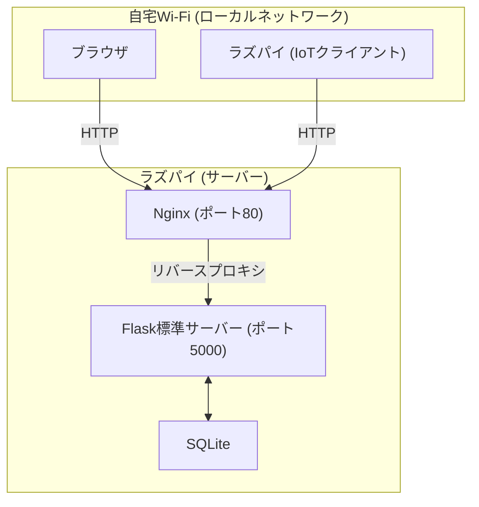
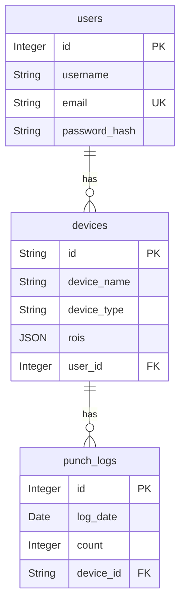

# 遠隔操作Webサイト バックエンド設計仕様書

**バージョン**: 1.3 (詳細版)  
**最終更新日**: 2025/09/15

---

## 更新履歴

| バージョン | 日付 | 内容 |
| :---- | :---- | :---- |
| v1.3 | 2025/09/15 | `POST /api/stats/compare` エンドポイント追加。`update:status` Socket.IOイベント追加。オンライン状態管理ロジック・複数機器統計比較ロジックを追記。 |
| v1.2 | 2025/09/01 | `deviceId` のサーバー側自動採番、ROI設定APIの追加、Socket.IOイベントの整理。 |

---

## 1. 概要

### 1.1. プロジェクトの目的

本文書は、「遠隔操作用Webサイト」プロジェクトのバックエンドサーバーの設計仕様を定義するものである。

本サーバーは、Webブラウザ（フロントエンド）とIoT機器（ラズパイ）の間に立つ**中央ハブ**として機能し、両者間の通信を中継・管理する責務を負う。具体的には、REST APIによるデータ操作、Socket.IOによるリアルタイム通信、およびSQLiteデータベースによるデータ永続化を行う。

### 1.2. 本書の目的

本書は、本サーバーアプリケーションのアーキテクチャ、機能、実装詳細、セットアップ手順、および運用方法を網羅的に記述し、開発者間の共通理解を形成するとともに、将来のメンテナンスや機能拡張の際の技術的な参照資料となることを目的とする。

---

## 2. アーキテクチャと技術スタック

### 2.1. アーキテクチャ図

現行のローカル完結型構成（Nginx + Flask標準サーバー）。



### 2.2. 技術スタック

| 分類 | 技術・ライブラリ | 選定理由 |
| :---- | :---- | :---- |
| **Webフレームワーク** | Flask | 軽量で学習コストが低く、APIサーバーとして十分な機能を持ち、柔軟な拡張が可能なため |
| **リアルタイム通信** | Flask-SocketIO (threadingモード) | Flaskとシームレスに統合でき、WebSocketの複雑な処理を抽象化。自動再接続やフォールバック機能も備える |
| **データベース** | SQLite | ファイルベースでセットアップ不要。ローカル完結型の本番環境として採用 |
| **ORM** | SQLAlchemy | PythonオブジェクトとしてDBを操作可能。SQLインジェクション対策にもなり、将来的なDB移行も容易 |
| **認証** | PyJWT | JWT (JSON Web Token) の生成と検証を行うための標準的なライブラリ |
| **CORS対応** | Flask-CORS | 異なるオリジンからのAPIリクエストを安全に許可するための設定を容易にする |
| **リバースプロキシ** | Nginx | 静的ファイルの配信と、API/Socket.IOリクエストのFlaskへの中継 |

---

## 3. データベーススキーマ設計

### 3.1. ER図



### 3.2. テーブル定義

| テーブル名 | 説明 |
| :---- | :---- |
| `users` | アプリケーションのユーザー情報を格納 |
| `devices` | 各ユーザーが登録したIoT機器の情報を格納 |
| `punch_logs` | 各機器の日ごとのパンチ回数を記録する時系列データテーブル |

#### `users` テーブル

| カラム名 | データ型 | 制約 | 説明 |
| :---- | :---- | :---- | :---- |
| `id` | `Integer` | PK | ユーザーID（自動採番） |
| `username` | `String(80)` | Not Null | 表示用のユーザー名 |
| `email` | `String(120)` | Not Null, Unique | ログインに使用するメールアドレス |
| `password_hash` | `String(128)` | Not Null | ハッシュ化されたパスワード |

#### `devices` テーブル

| カラム名 | データ型 | 制約 | 説明 |
| :---- | :---- | :---- | :---- |
| `id` | `String(80)` | PK | 機器ID（`robo-XXXXXX`形式） |
| `device_name` | `String(120)` | Not Null | ユーザーが設定した機器名 |
| `device_type` | `String(80)` | Not Null | 機器の種類（例: `punching_doll`） |
| `rois` | `JSON` | Nullable | カメラの監視範囲設定（JSON配列） |
| `user_id` | `Integer` | FK (`users.id`) | このデバイスを所有するユーザーのID |

#### `punch_logs` テーブル

| カラム名 | データ型 | 制約 | 説明 |
| :---- | :---- | :---- | :---- |
| `id` | `Integer` | PK | ログID（自動採番） |
| `device_id` | `String(80)` | FK (`devices.id`) | ログに対応する機器のID |
| `count` | `Integer` | Not Null | その日の合計パンチ回数 |
| `log_date` | `Date` | Not Null | ログの日付 (`YYYY-MM-DD`) |

---

## 4. API仕様

APIの仕様は「遠隔操作Webサイト API仕様書」に準拠する。

### 4.1. REST API サマリー

| エンドポイント | メソッド | 認証 | 説明 |
| :---- | :---- | :---- | :---- |
| `/api/auth/login` | `POST` | 不要 | ユーザー認証を行い、JWTを返却する |
| `/api/devices` | `GET`, `POST` | 必要 | デバイスのリスト取得と新規登録 |
| `/api/devices/{id}` | `GET`, `PATCH`, `DELETE` | 必要 | 特定デバイスの詳細取得、更新、削除 |
| `/api/devices/{id}/stats` | `GET` | 必要 | 特定デバイスの統計履歴を取得する |
| `/api/devices/{id}/config` | `PUT` | 必要 | 特定デバイスの設定（ROIなど）を更新する |
| `/api/stats/compare` | `POST` | 必要 | **（新規）** 複数デバイスの統計データを比較用に取得する |

### 4.2. リアルタイムAPI（Socket.IO）サマリー

| イベント名 | 方向 | データペイロード例 | 説明 |
| :---- | :---- | :---- | :---- |
| `device:register` | RPi → Srv | `{"deviceId": "..."}` | RPiが自身のIDを通知し、部屋に参加する |
| `browser:join_room` | Web → Srv | `{"deviceId": "..."}` | Webブラウザが特定のデバイスの部屋に参加する |
| `device:log_punch` | RPi → Srv | `{"deviceId": "...", "count": 1}` | パンチを検出したことを通知する |
| `stream:frame` | RPi ⇔ Srv ⇔ Web | `{"deviceId": "...", "image": "..."}` | 映像フレームを中継する |
| `update:stats` | Srv → Web | `{"deviceId": "...", "todayCount": ...}` | 統計データの更新をWebブラウザに通知する |
| `update:status` | Srv → Web | `{"deviceId": "...", "isOnline": ...}` | **（新規）** 機器のオンライン状態の変化を通知する |
| `command:execute_action` | Web ⇔ Srv ⇔ RPi | `{"deviceId": "...", "action": "..."}` | 遠隔操作命令を中継する |
| `config:update` | Srv → RPi | `{"rois": [...]}` | ROI設定の更新をラズパイに通知する |

---

## 5. ビジネスロジック

### 5.1. 認証と認可（`@token_required` デコレータ）

JWTを用いたステートレス認証を実装。デコレータはリクエストヘッダーから `Bearer` トークンを検証し、有効な場合はペイロード内の `user_id` からユーザーオブジェクトを特定する。

> **注意**: SQLAlchemyの `DetachedInstanceError` を避けるため、デコレータ内で生成したデータベースセッション（`db`）を後続のAPI関数に引数として渡し、リクエスト処理の最後までセッションを維持する。

### 5.2. リアルタイム中継（ルーム機能）

各 `deviceId` をルーム名として利用し、クライアント（ラズパイ・Webブラウザ）を対応する部屋に参加させる。サーバーは、特定のクライアントから受信したイベントを同じルームの他のクライアントにブロードキャストすることで、1対多・多対1の通信を効率的に実現する。

### 5.3. デバイスIDの自動生成

新規デバイス登録時、サーバーは `devices` テーブルを検索して `robo-` プレフィックスを持つ最大のIDを特定し、その数値部分に1を加算した新しい連番ID（例: `robo-000001`）を自動で生成する。

### 5.4. オンライン状態管理

| 状態 | 処理内容 |
| :---- | :---- |
| **状態保持** | メモリ上にオンライン状態の `deviceId` を保持する `set`（`online_devices`）と、セッションIDと `deviceId` を紐付ける辞書（`sid_to_device`）を持つ |
| **オンライン** | ラズパイが `device:register` を送信すると、`online_devices` に追加・`sid_to_device` にマッピングを記録し、`update:status` を全クライアントにブロードキャストする。ROI設定がDBに存在する場合は、接続してきたデバイスに `config:update` を即時送信する |
| **オフライン** | クライアントが切断（`disconnect`）した際、`sid_to_device` に存在すればラズパイの切断と判断。`online_devices` から削除し、`update:status` をブロードキャストする |

### 5.5. 複数機器の統計比較

`POST /api/stats/compare` 受信時の処理手順：

1. リクエストボディから `deviceIds` のリストと `period` を取得する
2. リクエストしてきたユーザーが、指定された全 `deviceIds` の所有者であることを検証する
3. 各 `deviceId` について、指定された期間の `punch_logs` をDBから取得する
4. 全デバイスに共通する日付のリストを作成し、データが存在しない日はカウントを `0` として補完する
5. 各デバイスの整形済み時系列データを、`deviceId` をキーとする辞書形式で返却する

---

## 6. 環境構築

### 6.1. 開発環境セットアップ

1. **仮想環境の構築**:

```bash
# venvの場合
python -m venv .venv
source .venv/bin/activate        # Mac/Linux
.venv\Scripts\activate           # Windows
```

2. **`requirements.txt` の作成**:

```plaintext
Flask
Flask-SocketIO
eventlet
SQLAlchemy
psycopg2-binary
python-dotenv
PyJWT
Flask-CORS
werkzeug
click
```

3. **ライブラリのインストール**:

```bash
pip install -r requirements.txt
```

4. **`.env` ファイルの作成**:

```
SECRET_KEY="your-secret-key"
DATABASE_URL="sqlite:///./test.db"
```

5. **データベースの初期化**:

```bash
flask init-db
flask create-user "test@example.com" "Test User" "password123"
```

6. **開発サーバーの起動**:

```bash
python app.py
```

### 6.2. 本番環境（ローカル完結型）

統合セットアップ手順は「遠隔操作システム ローカル完結型 設計仕様書」を参照。

> **将来の拡張**: クラウド（AWS等）への移行時は、SQLite → PostgreSQL への切り替えと Gunicorn の導入が必要。詳細は「ナレッジ：SQLite と PostgreSQL の使い分け」「ナレッジ：本番環境 Nginx + Gunicorn 構成」を参照。
