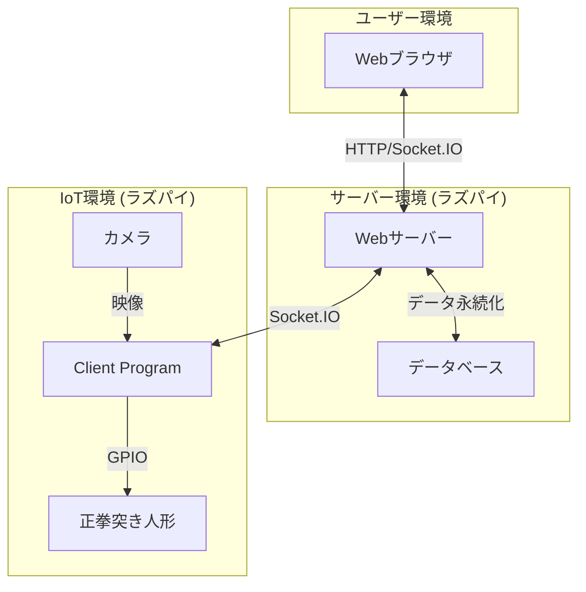
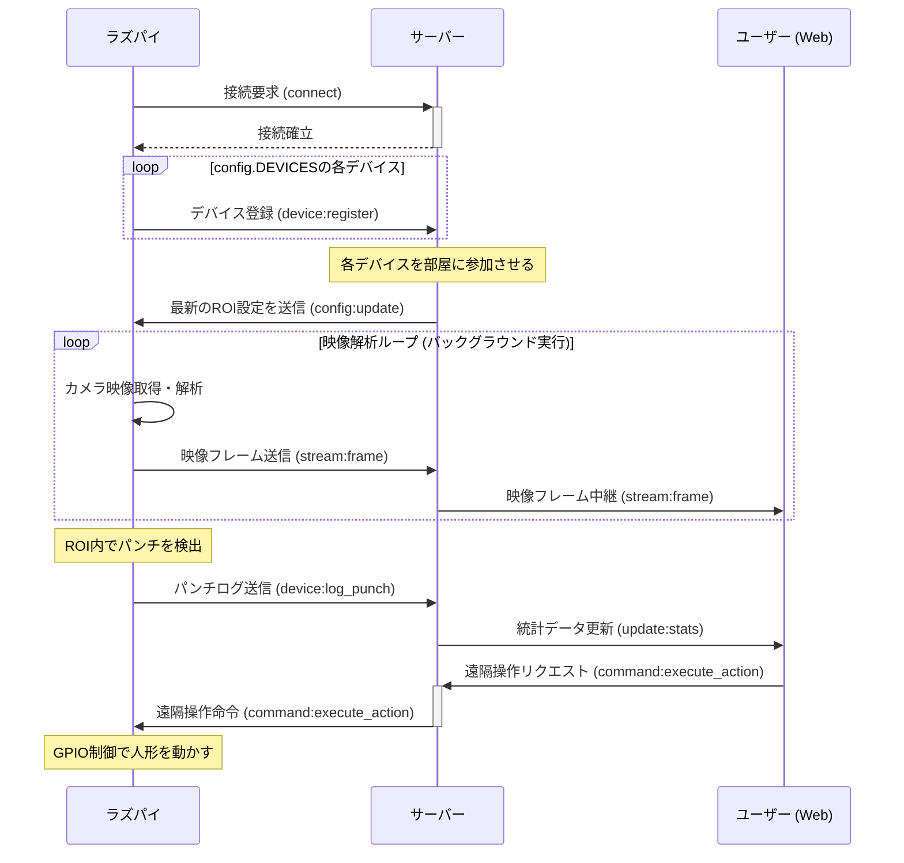

# Raspberry Pi 遠隔操作クライアント 設計仕様書

**バージョン**: 1.2 (詳細版)  
**最終更新日**: 2025/09/01

---

## 1. 概要

### 1.1. プロジェクトの目的

本文書は、「遠隔操作用Webサイト」プロジェクトにおいて、IoT機器として機能するRaspberry Pi 5上で動作するクライアントプログラムの設計仕様を定義するものである。

本プログラムの目的は、物理的なおもちゃ（正拳突き人形）の制御、カメラ映像を用いた動作認識、およびバックエンドサーバーとのリアルタイム双方向通信を実現することにある。これにより、ユーザーに遠隔地から物理デバイスと対話する新しい体験を提供し、テクノロジーへの興味を喚起する。

### 1.2. 本書の目的

本書は、本クライアントプログラムのアーキテクチャ、機能、実装詳細、セットアップ手順、および運用方法を網羅的に記述し、開発者間の共通理解を形成するとともに、将来のメンテナンスや機能拡張の際の技術的な参照資料となることを目的とする。

---

## 2. アーキテクチャと役割

### 2.1. 全体アーキテクチャ

本クライアントは、Webブラウザ（フロントエンド）、Webサーバー（バックエンド）と共に3層構造のシステムを構成する。各層は独立しており、APIを介して疎結合に連携する。



### 2.2. 本クライアントの責務

本クライアントプログラムは、IoT環境における中核として、以下の3つの主要な責務を担う。

- **物理世界の代理人 (Actuator)**: サーバーからの命令（`command:execute_action`）を受け、GPIOを通じて物理的なデバイス（正拳突き人形）を操作する。
- **現実世界の観測者 (Sensor)**: カメラを通じて物理的なイベント（パンチ動作）を常時観測し、画像認識によってデジタルデータに変換してサーバーに報告する。
- **通信端末 (Communicator)**: サーバーとの間に常時接続（WebSocket）を確立・維持し、リアルタイムな情報交換（ログ送信、命令受信）を行う。

---

## 3. 設計方針

本プログラムは、長期的なメンテナンス性と将来的な拡張性を高めるため、以下の設計方針に基づき構築されている。

**モジュール化設計**
- 機能ごとにPythonファイルを分割（`hardware_controller`, `vision_analyzer`等）し、各モジュールが単一の責務を持つように設計する。
- 修正時の影響範囲を限定するため。例えば、画像認識のアルゴリズムを変更する場合、`vision_analyzer.py` のみを修正すればよい。

**イベント駆動アーキテクチャ**
- モジュール間の連携は、コールバック関数を用いて疎結合に保つ。「何かが起きたら（イベント）、登録された処理（コールバック）を呼び出す」という形式で、司令塔である `main.py` が全体の動作を管理する。
- 各モジュールが他のモジュールの内部実装を知る必要がなくなり、独立性が高まる。例えば、`vision_analyzer` はパンチを検出した後の処理（ネットワーク送信など）を意識する必要がない。

**並列処理**
- カメラからの映像解析は常時行う必要があるため、Pythonの `threading` モジュールを用いてバックグラウンドスレッドで実行する。
- 重い画像認識処理中でも、メインスレッドはサーバーからのリアルタイムな命令受信をブロックされることなく即座に応答できる。遠隔操作の応答性を確保するため。

**設定の外部化**
- 物理的な接続情報（ピン番号）、ネットワーク設定、画像認識の閾値などを `config.py` に分離する。
- コード本体を変更することなく、環境に合わせた設定変更（例: GPIOピンの変更、接続先サーバーURLの変更）を容易にするため。

---

## 4. 使用技術スタック

| 技術・ライブラリ | 用途 | 選定理由 |
| :---- | :---- | :---- |
| **Python 3.11** | 開発言語 | Raspberry Pi OSで標準サポートされており、豊富なライブラリ資産を持つため |
| **picamera2** | カメラ制御 | Raspberry Pi 5の新カメラシステム `libcamera` とネイティブ連携する公式ライブラリ。最も安定した映像取得が期待できるため |
| **OpenCV-Python** | 画像認識 | `picamera2` から受け取った映像を解析し、背景差分法で物体の動きを検出・カウントするための事実上の標準ライブラリ |
| **gpiozero** | ハードウェア制御 | Raspberry Pi 5に公式対応した新しいGPIO制御ライブラリ。`RPi.GPIO` よりも高レベルで直感的なAPIを提供し、コードの可読性が高いため |
| **python-socketio** | リアルタイム通信 | バックエンドサーバーとのWebSocket通信を行い、イベントベースの双方向通信を容易に実装できるため。自動再接続機能も備えている |

---

## 5. サーバーとの通信シーケンス

クライアント（ラズパイ）とサーバー間の主要な通信シーケンスは以下の通り。



---

## 6. モジュール詳細設計

### 6.1. `config.py`

- **役割**: プログラム全体で使用する静的な設定値を一元管理する。
- **主要な変数**:

| 変数名 | 型 | 説明 |
| :---- | :---- | :---- |
| `DEVICES` | dict | キーに `deviceId`、値にハードウェア情報（`pin` 番号、`name`）を持つ |
| `CAMERAS` | list | 使用するカメラ（`index`）と監視範囲（`rois`）のリスト |
| `SERVER_URL` | str | 接続先バックエンドサーバーのURL |
| `RASPBERRY_PI_ID` | str | このラズパイを識別するID |
| `CAMERA_RESOLUTION_WIDTH` | int | カメラ映像の横解像度（ピクセル） |
| `CAMERA_RESOLUTION_HEIGHT` | int | カメラ映像の縦解像度（ピクセル） |
| `CAMERA_FRAMERATE` | int | カメラのフレームレート（fps） |
| `PUNCH_DETECTION_THRESHOLD` | int | パンチとして認識する動きの最小面積（ピクセル数） |
| `CAMERA_WARMUP_FRAMES` | int | 起動直後に背景学習に専念するフレーム数。この間はパンチ検出を行わない |
| `ENABLE_LOCAL_PREVIEW` | bool | デバッグ用プレビューウィンドウ表示の制御フラグ |

### 6.2. `hardware_controller.py`

- **役割**: GPIOピンの制御に特化し、ハードウェア操作を抽象化する。
- **主要クラス**: `HardwareController`

| メソッド | 説明 |
| :---- | :---- |
| `__init__(self, device_configs)` | `config.DEVICES` 辞書を受け取り、初期化する |
| `setup(self)` | `device_configs` に基づき、全GPIOピンを `gpiozero.OutputDevice` として初期化する |
| `trigger_punch(self, device_id, duration=0.1)` | 指定した `device_id` に対応するピンにLOWパルスを送信し、AVRマイコンをトリガーする。`duration` でパルス幅（秒）を指定できる |
| `cleanup(self)` | `close()` を呼び出し、使用した全GPIOピンを安全に解放する |

### 6.3. `vision_analyzer.py`

- **役割**: 単一のカメラ映像を解析し、設定されたROI内の動きを検出して対応する `deviceId` を通知する。
- **主要クラス**: `VisionAnalyzer`

| メソッド | 説明 |
| :---- | :---- |
| `__init__(self, camera_config, punch_callback, stream_callback)` | カメラ設定と2つのコールバック関数を受け取る |
| `start_analysis(self)` | カメラを起動し、映像解析のメインループを開始する。`CAMERA_WARMUP_FRAMES` の間は背景学習に専念する |
| `_analyze_frame(self, frame, frame_counter)` | 背景差分法で各ROI内の動きを検出し、閾値超過時に `punch_callback` を呼び出す。デバウンス処理も含む |
| `update_rois(self, new_rois)` | サーバーからの命令で、監視するROI設定を動的に更新する |

### 6.4. `network_client.py`

- **役割**: バックエンドサーバーとのSocket.IO通信に関する全処理を担当する。
- **主要クラス**: `NetworkClient`

| メソッド | 説明 |
| :---- | :---- |
| `__init__(self)` | `socketio.Client` インスタンスを生成し、サーバーからの各イベントに対応する内部ハンドラを登録する |
| `start(self)` | サーバーへの接続を開始する。失敗した場合は5秒後に再試行を繰り返す |
| `stop(self)` | サーバーから切断する |
| `send_punch_log(self, device_id, count)` | パンチログを `device:log_punch` イベントでサーバーに送信する |
| `send_frame_stream(self, device_id, image_data)` | JPEGエンコードされた映像フレームを `stream:frame` イベントで送信する |

### 6.5. `main.py`

- **役割**: 全モジュールを統括する司令塔。アプリケーションのライフサイクルを管理する。
- **主要クラス**: `MainApp`

| メソッド | 説明 |
| :---- | :---- |
| `__init__(self)` | 各モジュールのインスタンスを生成し、コールバック関数を設定してモジュール間を連携させる |
| `run(self)` | `vision_analyzer` をバックグラウンドスレッドで起動し、メインスレッドで `network_client` の接続を開始する |
| `stop(self)` | プログラム終了時に各モジュールのクリーンアップ処理を呼び出す |
| `_on_punch_detected(self, ...)` | パンチ検出時のコールバック。`network_client` 経由でサーバーに通知する |
| `_on_frame_stream(self, camera_index, image_data)` | 映像フレーム受信時のコールバック。カメラインデックスに対応する全デバイスに `network_client` 経由でフレームを送信する |
| `_on_remote_command(self, ...)` | 遠隔操作命令受信時のコールバック。`hardware_controller` 経由で人形を動かす |
| `_on_config_update(self, data)` | ROI設定更新命令受信時のコールバック。`vision_analyzer` に新しいROI設定を反映する |

---

## 7. セットアップ手順

### 7.1. 前提条件

- Raspberry Pi OS (Bookworm) 64bit版がインストール済みであること
- インターネットに接続可能であること
- カメラモジュールが物理的に接続済みであること

### 7.2. 手順

1. **カメラの有効化**:

```bash
sudo nano /boot/firmware/config.txt
# ファイル末尾に camera_auto_detect=1 を追記して保存
sudo reboot
```

2. **OSパッケージのインストール**:

```bash
sudo apt update && sudo apt upgrade -y

sudo apt install -y python3-opencv libopencv-dev libatlas-base-dev \
  libavformat-dev libavcodec-dev libgtk-3-dev libswscale-dev libcap-dev \
  python3-picamera2 libcamera-apps python3-libcamera
```

3. **Python仮想環境の構築**:

```bash
python3 -m venv --system-site-packages .venv
source .venv/bin/activate
```

4. **`requirements.txt` の作成**:

```plaintext
gpiozero
opencv-python
python-socketio[client]
eventlet
```

5. **Pythonライブラリのインストール**:

```bash
pip install -r requirements.txt
```

---

## 8. 試験方法

### 8.1. 単体試験

各モジュールは `if __name__ == '__main__':` ブロック内に単体動作確認用のテストコードを持つ。各部品が正しく機能するかを個別に検証できる。

例として `python3 hardware_controller.py` を実行すると、設定された全デバイスのパンチ動作を順番にテストする。

### 8.2. 結合試験

PCでバックエンドサーバーを実行した状態でラズパイの `main.py` を実行し、以下を確認する。

- [ ] サーバーへの接続・`device:register` による部屋への参加・`config:update` によるROI同期が正しく行われること
- [ ] Webサイトの詳細ページでカメラ映像のストリーミングがリアルタイムに表示されること
- [ ] 物理的なパンチ動作が検出され、サーバー経由でWebサイトのカウンターがリアルタイムに更新されること
- [ ] Webサイトからの遠隔操作命令で、物理的な人形が正しく動作すること

---

## 9. 運用（自動起動）

### 9.1. サービスファイルの作成

```bash
sudo nano /etc/systemd/system/seiken-client.service
```

```ini
[Unit]
Description=Seiken Puncher Client Application
After=network-online.target seiken-server.service
BindsTo=seiken-server.service

[Service]
Type=simple
User=kinokotaisa
WorkingDirectory=/home/kinokotaisa/python/seiken_gen2
Environment=PYTHONUNBUFFERED=1
ExecStart=/home/kinokotaisa/opencv/bin/python3 /home/kinokotaisa/python/seiken_gen2/main.py
Restart=on-failure

[Install]
WantedBy=multi-user.target
```

### 9.2. サービスの管理コマンド

| 操作 | コマンド |
| :---- | :---- |
| 有効化（自動起動登録） | `sudo systemctl enable seiken-client.service` |
| 無効化 | `sudo systemctl disable seiken-client.service` |
| 起動 | `sudo systemctl start seiken-client.service` |
| 停止 | `sudo systemctl stop seiken-client.service` |
| 状態確認 | `sudo systemctl status seiken-client.service` |
| ログ確認 | `journalctl -u seiken-client.service -f` |

> **注意**: 自動起動時はヘッドレス環境（画面なし）で実行されるため、`config.py` の `ENABLE_LOCAL_PREVIEW` を `False` に設定すること。
