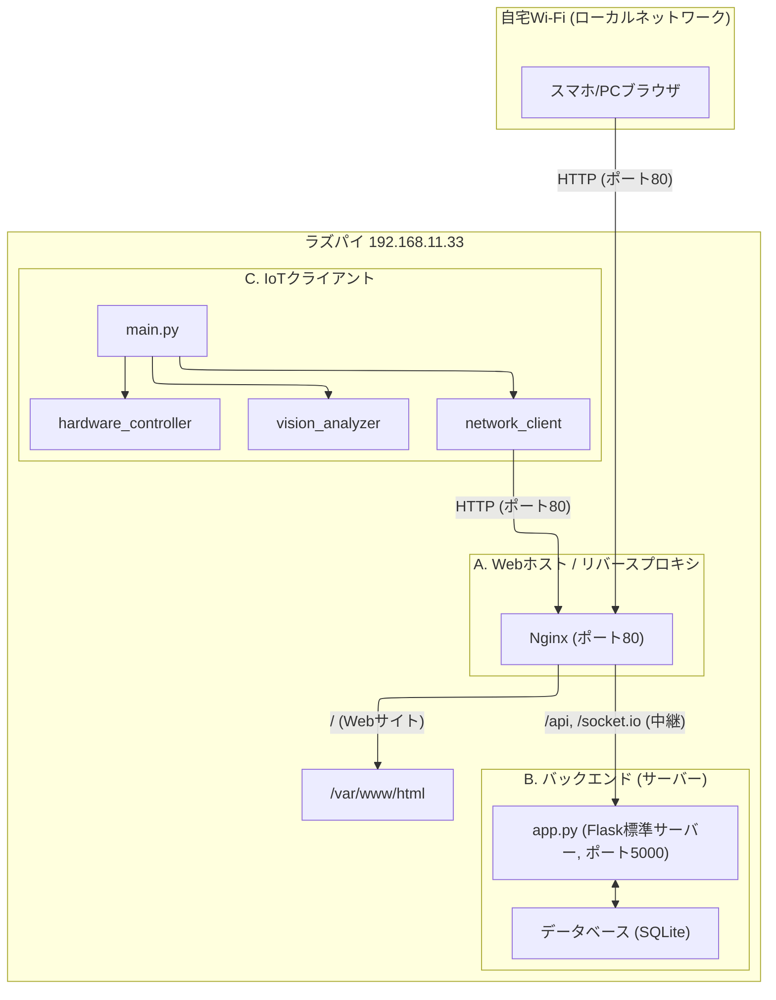

# 遠隔操作システム ローカル完結型 設計仕様書

**バージョン**: 1.1 (最終安定版)  
**最終更新日**: 2025/11/10

---

## 更新履歴

| バージョン | 日付 | 内容 |
| :---- | :---- | :---- |
| v1.1 | 2025/11/10 | アーキテクチャをGunicornなしの「Nginx + Flask標準サーバー」構成に修正。systemdサービスファイル・Nginx設定・`config.py`の`SERVER_URL`設定を最終版に更新。 |
| v1.0 | 2025/11/10 | 初版作成 |

---

## 1. 概要

### 1.1. プロジェクトの目的

本文書は、「遠隔操作用Webサイト」プロジェクトの全システム（サーバー、クライアント、フロントエンド）を、一台のRaspberry Pi 5上に同居させ、ローカルネットワーク内で完結させるための設計仕様を定義するものである。

### 1.2. 本書の目的

ラズパイ上で動作する3つの主要コンポーネント（バックエンド、フロントエンド、IoTクライアント）の統合アーキテクチャ、機能、実装詳細、セットアップ手順、および運用方法を網羅的に記述する。

---

## 2. アーキテクチャと技術スタック

### 2.1. 全体アーキテクチャ

一台のラズパイがサーバー・クライアント・Webホストの3役を兼任する。ユーザーは同一ローカルネットワーク内のスマホ/PCから、ラズパイのIPアドレス（ポート80）に直接アクセスする。



### 2.2. 技術スタック

| コンポーネント | 技術・ライブラリ | 用途 |
| :---- | :---- | :---- |
| **全共通** | Git / GitHub | バージョン管理とコード配布 |
|  | systemd | 全サービスの自動起動とプロセス管理 |
| **バックエンド** | Flask, Flask-SocketIO (threadingモード) | APIサーバー・Socket.IOサーバーの実行。Gunicornとの互換性問題を回避するためFlask標準サーバーを使用。 |
|  | SQLAlchemy, SQLite | データベース操作とデータ永続化 |
| **IoTクライアント** | Python 3.11, threading | クライアントロジックの実行 |
|  | picamera2, OpenCV | カメラ制御と画像認識 |
|  | gpiozero | GPIOを通じたハードウェア（人形）制御 |
|  | python-socketio | サーバーへのリアルタイム通信 |
| **フロントエンド** | Vue.js 3, Vite | ユーザーインターフェースの構築 |
|  | Nginx | 静的ファイル（HTML/JS/CSS）の配信と、API/Socket.IOリクエストのバックエンドへのリバースプロキシ |

---

## 3. データベーススキーマ設計

- **選定**: セットアップ不要な SQLite を本番環境でも使用する（PostgreSQLは不使用）
- **ファイルパス**: `/home/kinokotaisa/seiken-server/test.db`
- **スキーマ定義**: バックエンド設計仕様書 v1.3 に準拠（`users`, `devices`, `punch_logs` テーブル）

---

## 4. API仕様

- 詳細はバックエンド設計仕様書 v1.3 に準拠する
- **APIエンドポイント**: `http://192.168.11.33/api/...`（ラズパイのIPアドレス経由）
- **Socket.IOエンドポイント**: `http://192.168.11.33`

---

## 5. ビジネスロジック

- 詳細はバックエンド設計仕様書 v1.3 に準拠する
- **重要**: `main.py`（threading使用）と`app.py`（eventlet使用）の並列処理モデル競合を回避するため、`app.py` も threading モードで実行し、`main.py` は Nginx 経由で `app.py` に接続する

---

## 6. コンポーネント詳細設計

### 6.1. サーバーコンポーネント（`seiken-server`）

| 項目 | 内容 |
| :---- | :---- |
| 役割 | APIとSocket.IOの中継ハブ。データベース管理。 |
| 実行方法 | `systemd` により `python3 app.py` で直接起動 |
| 待機アドレス | `127.0.0.1:5000` |
| プロジェクトパス | `/home/kinokotaisa/seiken-server` |

### 6.2. IoTクライアントコンポーネント（`seiken-client`）

| 項目 | 内容 |
| :---- | :---- |
| 役割 | ハードウェア制御と画像認識 |
| 実行方法 | `systemd` により `python3 main.py` で起動 |
| プロジェクトパス | `/home/kinokotaisa/python/seiken_gen2` |

> **重要設定**: `config.py` の `SERVER_URL` は `localhost:5000`（サーバーへの直接接続）ではなく、Nginx 経由のラズパイ自身のIPアドレス（例: `http://192.168.11.33`）に設定すること。`ENABLE_LOCAL_PREVIEW` は `False` に設定する。

### 6.3. フロントエンドコンポーネント（`seiken-frontend`）

| 項目 | 内容 |
| :---- | :---- |
| 役割 | ユーザーがアクセスするWebサイト本体 |
| 実行方法 | `npm run build` でビルドした静的ファイルをNginxが配信 |
| 配置パス | `/var/www/html` |

> **重要設定**: `axios.js` と `socketService.js` のURLはIPアドレスをハードコーディングせず、相対パス（`/api` および `/`）に設定すること。

---

## 7. 統合セットアップ手順

新規の Raspberry Pi 5 に全コンポーネントをセットアップする手順。

### 7.1. OSとシステムツールの準備

1. **OSセットアップ**: Raspberry Pi OS (Bookworm) 64bit版をインストールし、ネットワーク（Wi-Fi/LAN）に接続する。

2. **IPアドレス固定**: ルーターの管理画面で、ラズパイのMACアドレスに対してIPアドレス（例: `192.168.11.33`）を固定割り当てする。

3. **カメラ有効化**:

```bash
sudo nano /boot/firmware/config.txt
# camera_auto_detect=1 を追記して保存
sudo reboot
```

4. **必要パッケージのインストール**:

```bash
sudo apt update && sudo apt upgrade -y

sudo apt install -y nginx git python3-venv python3-opencv libopencv-dev \
       libatlas-base-dev libavformat-dev libavcodec-dev libgtk-3-dev \
       libswscale-dev libcap-dev python3-picamera2 libcamera-apps \
       python3-libcamera postgresql-client
```

### 7.2. サーバー（バックエンド）のセットアップ

1. **コードのダウンロード**:

```bash
cd /home/kinokotaisa
git clone https://github.com/kinokotaisa/seiken-server.git
```

2. **仮想環境の構築とライブラリのインストール**:

```bash
cd /home/kinokotaisa/seiken-server
python3 -m venv .venv
source .venv/bin/activate
pip install -r requirements.txt
deactivate
```

3. **`.env` ファイルの作成**:

```bash
nano .env
```

以下の内容を記述する：

```
SECRET_KEY="<任意の強力な秘密鍵>"
DATABASE_URL="sqlite:///./test.db"
```

4. **データベースの初期化**:

```bash
source .venv/bin/activate
flask init-db
flask create-user "test@example.com" "Test User" "password123"
deactivate
```

> **注意**: `app.py` は `socketio.run(..., port=5000, ...)` で起動するよう設定されていること。

### 7.3. IoTクライアントのセットアップ

1. **コードのダウンロード**:

```bash
cd /home/kinokotaisa
git clone https://github.com/kinokotaisa/seiken-pi-client.git python/seiken_gen2
```

2. **仮想環境の構築とライブラリのインストール**:

```bash
cd /home/kinokotaisa/python/seiken_gen2
python3 -m venv --system-site-packages .venv
source .venv/bin/activate
pip install -r requirements.txt
deactivate
```

3. **`config.py` の修正**:

```bash
nano config.py
```

以下の2点を修正する：

```python
SERVER_URL = "http://192.168.11.33"  # ラズパイのIPアドレスに変更
ENABLE_LOCAL_PREVIEW = False
```

### 7.4. フロントエンド（Webサイト）のセットアップ

1. **PCでビルド**:
   - `seiken-frontend` プロジェクトフォルダで `axios.js` と `socketService.js` のURLが相対パス（`/api`, `/`）になっていることを確認する
   - `npm run build` を実行し、`dist` フォルダを生成する

2. **ラズパイに転送**（PCのターミナルで実行）:

```powershell
scp -i <あなたの鍵> -r dist kinokotaisa@<ラズパイのIPアドレス>:~/
```

3. **ラズパイでファイルを配置**:

```bash
sudo rm -rf /var/www/html/*
sudo mv ~/dist/* /var/www/html/
sudo chown -R www-data:www-data /var/www/html
sudo find /var/www/html -type d -exec chmod 755 {} \;
sudo find /var/www/html -type f -exec chmod 644 {} \;
rm -rf ~/dist
```

---

## 8. 運用（自動起動）

### 8.1. サービスファイルの作成

#### サーバー（`seiken-server.service`）

```bash
sudo nano /etc/systemd/system/seiken-server.service
```

```ini
[Unit]
Description=Seiken Server (Flask Direct)
After=network-online.target
Wants=network-online.target

[Service]
User=kinokotaisa
WorkingDirectory=/home/kinokotaisa/seiken-server
# Gunicornではなく、仮想環境のpythonでapp.pyを直接実行
ExecStart=/home/kinokotaisa/seiken-server/.venv/bin/python3 /home/kinokotaisa/seiken-server/app.py
Restart=always

[Install]
WantedBy=multi-user.target
```

#### IoTクライアント（`seiken-client.service`）

```bash
sudo nano /etc/systemd/system/seiken-client.service
```

```ini
[Unit]
Description=Seiken Puncher Client Application
# サーバーが起動した後に起動する
After=network-online.target seiken-server.service
# サーバーが停止したら、クライアントも停止する
BindsTo=seiken-server.service

[Service]
User=kinokotaisa
WorkingDirectory=/home/kinokotaisa/python/seiken_gen2
ExecStart=/home/kinokotaisa/opencv/bin/python3 /home/kinokotaisa/python/seiken_gen2/main.py
Restart=on-failure

[Install]
WantedBy=multi-user.target
```

### 8.2. Nginxの設定

1. **設定ファイルを作成**:

```bash
sudo nano /etc/nginx/sites-available/seiken-local
```

2. **以下の内容を記述**（`<ラズパイのIPアドレス>` は実際のIPに置き換える）:

```nginx
upstream app_server {
    server 127.0.0.1:5000;
}

server {
    listen 80;
    server_name <ラズパイのIPアドレス>;

    root /var/www/html;
    index index.html;

    location /api {
        proxy_pass http://app_server;
        proxy_set_header Host $host;
        proxy_set_header X-Real-IP $remote_addr;
        proxy_set_header X-Forwarded-For $proxy_add_x_forwarded_for;
    }

    location /socket.io {
        proxy_pass http://app_server;
        proxy_http_version 1.1;
        proxy_set_header Upgrade $http_upgrade;
        proxy_set_header Connection "Upgrade";
    }

    location / {
        try_files $uri $uri/ /index.html;
    }
}
```

### 8.3. サービスの有効化と起動

1. **Nginxの設定を有効化**:

```bash
sudo ln -s /etc/nginx/sites-available/seiken-local /etc/nginx/sites-enabled
sudo rm /etc/nginx/sites-enabled/default
sudo nginx -t
```

2. **全サービスを起動・有効化**:

```bash
sudo systemctl daemon-reload
sudo systemctl enable seiken-server.service
sudo systemctl enable seiken-client.service
sudo systemctl start seiken-server.service
sudo systemctl start seiken-client.service
sudo systemctl restart nginx
```
